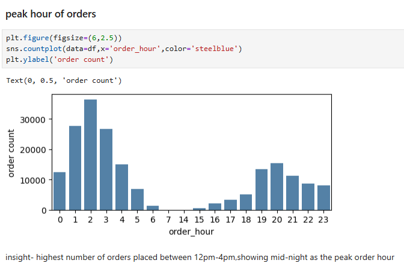
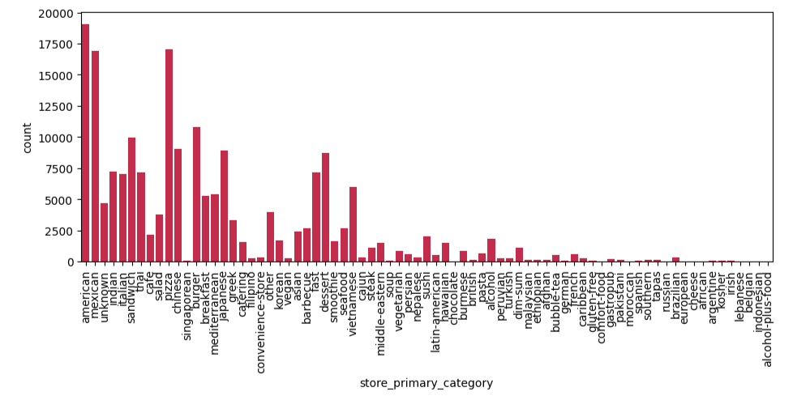

# 📦 Porter – Logistics & Operational Performance Analysis

## 📌  Overview
This project analyzes a real world logistic sector dataset from Porter to understand **demand patterns, revenue drivers and operational efficiency**.  
The analysis focuses on identifying peak-hour behavior, high-performing markets and protocols, customer ordering patterns, and capacity risks, and translates findings into actionable business recommendations.

---
## 📊 Dataset Overview
- **Total Records:** ~197,000+ orders  
- **Key Columns:**
  - Market ID  
  - Order Protocol  
  -  Primary food Category  
  - Order Volume  
  - Revenue (Subtotal)  
  - Order Date & Time  
  - Partner Availability Metrics  

## 🎯 Objectives
- Identify high-impact markets, protocols, and food categories
- Analyze peak-hour and weekend demand patterns
- Evaluate revenue concentration and customer behavior
- Provide data-driven recommendations to improve operational efficiency & delivery performance

---


### 📊 Key Insighs
**Demand Concentration:**
- **~71% of total orders** and **~73% of total revenue** are generating o from Market IDs 1,2 and 4  making them critical operational hubs.

**Protocol Performance:**
- Protocols 1, 3, and 5 account for over **75% of total orders and nearly 80% of revenue**, indicating strong alignment between customer preference and revenue contribution.
  
**Time-Based Trends:**
- Peak order hours: **12am – 5am**
- Peak hours contribute ~70% of total revenue
- Order volume and revenue increase by ~5% on weekends
- A sudden 11% drop in orders during the 3rd week indicates potential operational or external disruptions.
  
**Category Concentration:**
- Top **20% food categories** generate **75% of total orders** & also contributing **75% of revenue**, confirming a Pareto effect.

**Customer Behavior:**
- Order size of ~86%  customers are below or equal to 5 , highlighting a large base of low-frequency users and an opportunity to improve retention.

**Operational Efficiency (Derived KPIs):**
- Partner utilisation **exceeds 90%** during peak hours
- Orders per partner remain moderate (1–1.5), indicating that capacity shortage, not excessive demand, is the main constraint.
- High utilisation reduces buffer capacity and increases the risk of delivery delays.

---
## 📈 Visualizations

   
   
  
### 💡 Business Recommendations
**Peak-Hour Capacity Optimization**
- Introduce a **5–10% increase** in on-shift partners during peak hours (12–4 PM) to **reduce utilisation** to an optimal **80–85%**, improving delivery reliability without overstaffing.
  
**Focus on High-Impact Markets & Protocols**
- Prioritize operational planning, partner allocation, and promotions in Markets 1, 2, and 4 and strengthen Protocols 1, 3, and 5, which drive the majority of revenue.

  
**Category-Level Optimization**
- Focus marketing and operational efficiency efforts on top-performing food categories, while reassessing low-performing ones to reduce complexity.

**Monitoring & Risk Detection**
Set up early-warning indicators for:
- Sudden weekly order drops
- Partner utilisation exceeding 90%, signaling capacity constraints

---

## 🛠️ Tech Stack  

| Category | Tools & Libraries |
|-----------|------------------|
| Programming | Python |
| Data Analysis | Pandas, NumPy |
| Visualization | Matplotlib, Seaborn |
| Environment | Jupyter Notebook |

---

## 📊 Project Workflow  
1. **Data wrangling** — Handle missing values, duplicates and outliers.  
2. **Exploratory Data Analysis (EDA)** — Visualize trends, correlations and patterns.  
3. **Feature Engineering** — Derived partner utilisation & order per partner metrix
4. **Detailed KPI & performance Analysis** —Identify demand concentration, peak-hour risks and operational inefficiency
5. **Insights & Business Recommendations** — Summarize findings and propose improvements.  

---
## 📂 Repository Structure
```text
📁 porter-logistics-analysis
│
├── 📓 porter_analysis.ipynb
├── 📄 README.md
├── 📁 visuals
│   ├── market_contribution.png
│   ├── protocol_revenue_pareto.png
│   ├── hourly_demand.png
│
└── 📄 requirements.txt
```


 

---

## Executive Summary

This project demonstrates my ability to convert raw logistic & operational data into actionable business insights.
By identifying demand concentration, peak revenue periods, and protocol efficiencies, the analysis supports strategic decisions related to **capacity planning, operational efficiency and revenue growth**.

---

## 🧑‍💻 Author  
**Manish Nandi** | **Data Analyst**

⭐ If you find this project insightful, feel free to connect or reach out!

 [LinkedIn](www.linkedin.com/in/manish-nandi-52a69432a)  |
[Gmail](mannsqurz@gmail.com)  

---
